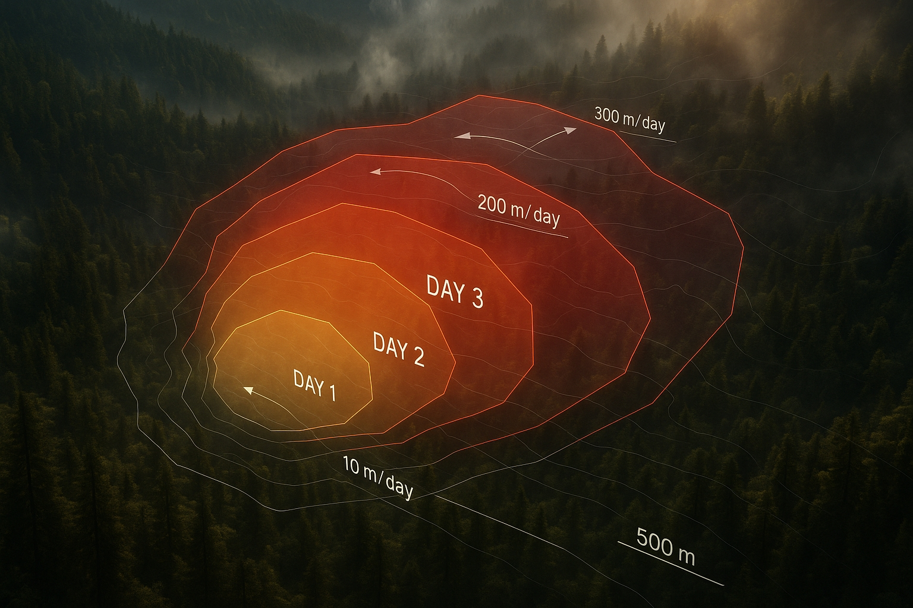
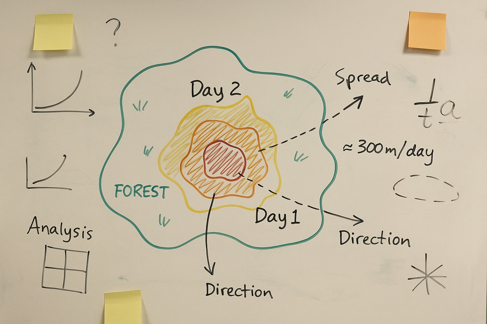
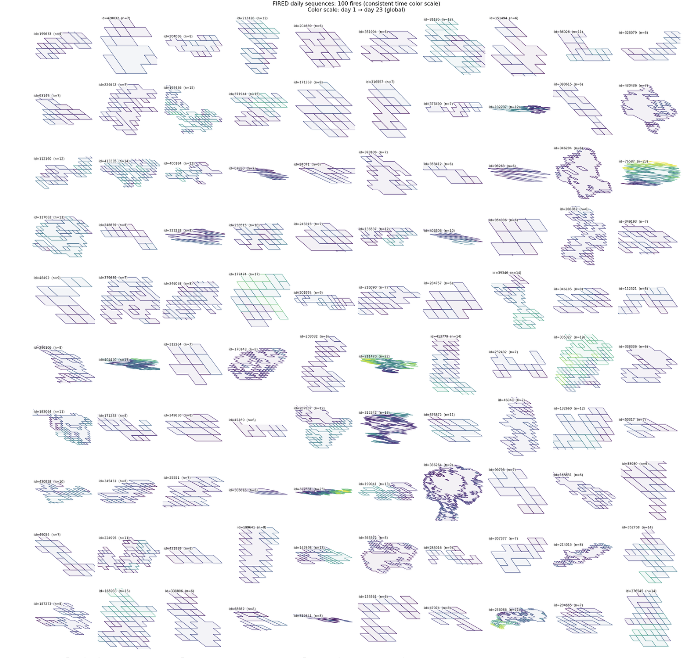
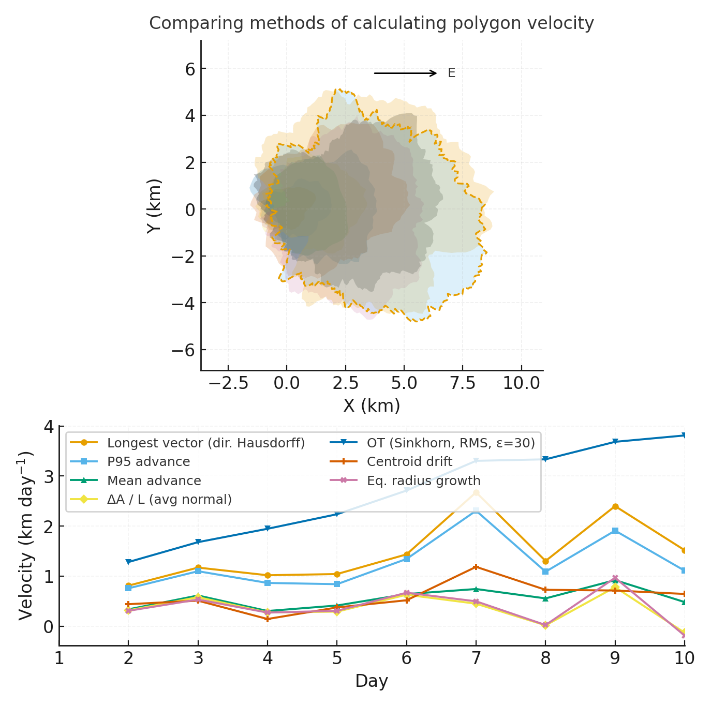
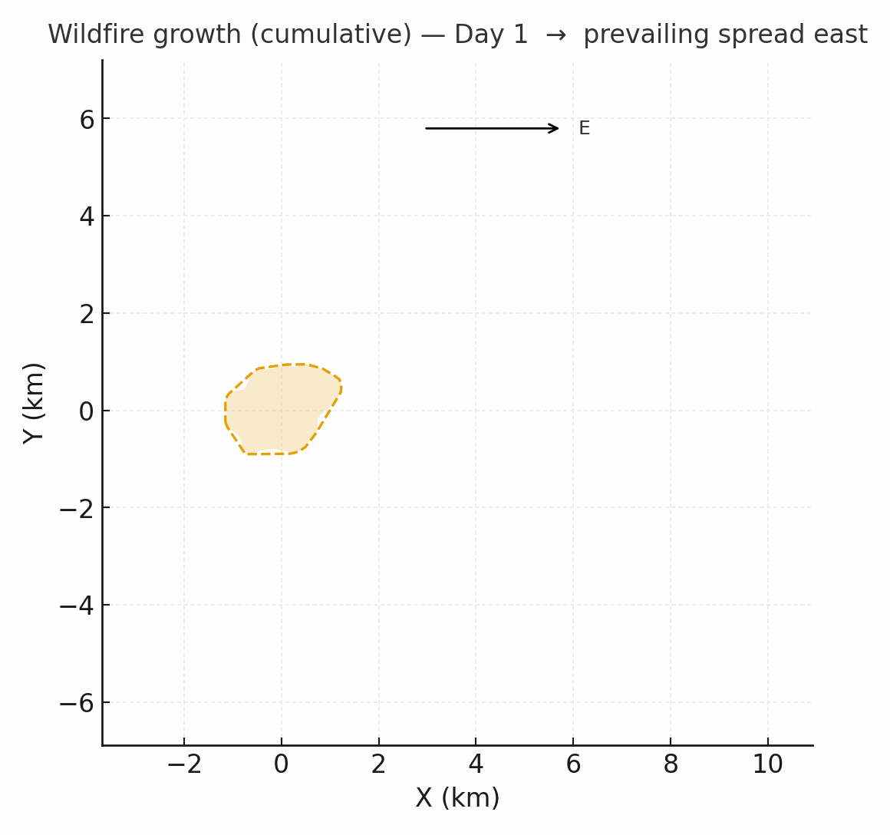
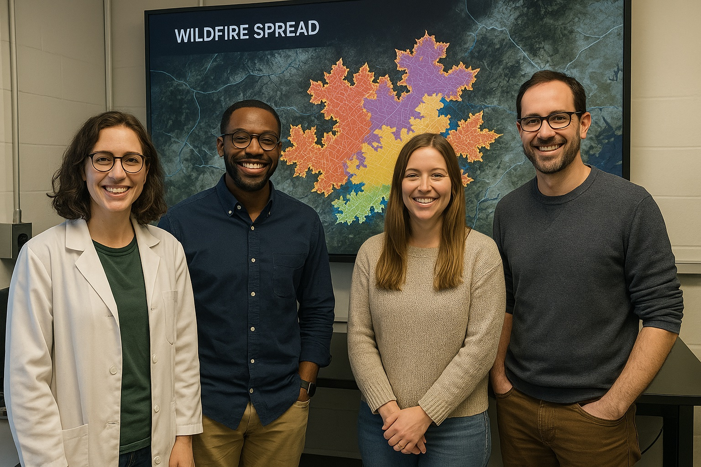
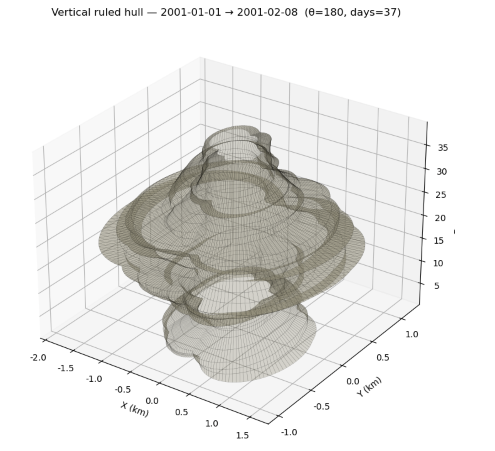
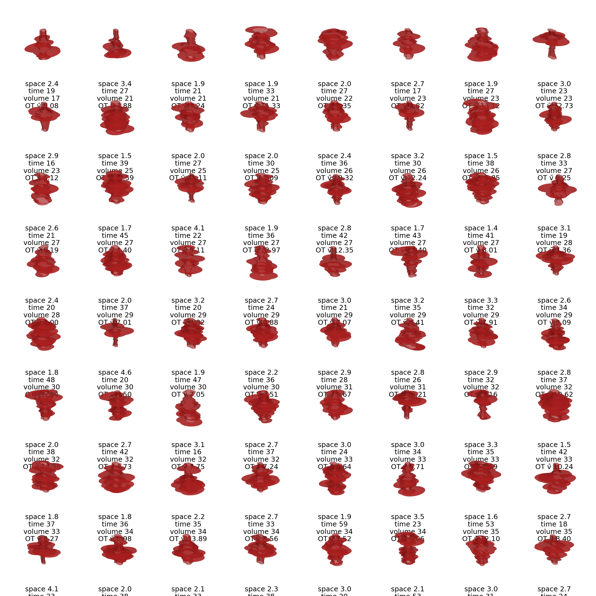
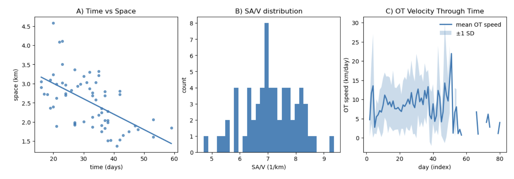

# Resilience for Rare Hydrologic Events Management

<a href="https://github.com/CU-ESIIL/resilience-rare-hydrologic-events-management-innovation-summit-2025__15/edit/main/docs/index.md" title="Edit this page">✏️</a>

<!-- =========================================================
HERO (Swap hero.jpg, title, strapline, and the three links)
========================================================= -->

[Raw photo location: hero.jpg](https://github.com/CU-ESIIL/resilience-rare-hydrologic-events-management-innovation-summit-2025__15/blob/main/docs/assets/hero.jpg)

**One sentence on impact:** In three days, Group 15 is prototyping data stories and decision aids that help water managers anticipate rare hydrologic extremes and plan resilient responses.

**[Project brief (PDF)](assets/Seven%20ways%20to%20measure%20fire%20polygon%20velocity-4.pdfa) · [View code](https://github.com/CU-ESIIL/resilience-rare-hydrologic-events-management-innovation-summit-2025__15/blob/main/code/fired_time_hull_panel.ipynb) · [Explore data](https://github.com/CU-ESIIL/resilience-rare-hydrologic-events-management-innovation-summit-2025__15/blob/main/code/prism_quicklook.py)**

> **About this site:** This is a public, in-progress record of a 3-day project at the Innovation Summit. Edit everything here in your browser: open a file → pencil icon → Commit changes.

---

## How to use this page (for the team)
- **Edit this file:** `docs/index.md` → ✎ → change text → **Commit changes**.
- **Add images:** upload to `docs/assets/` and reference like `assets/your_file.png`.
- Keep **text short** and **visuals first**. Think “slide captions,” not essays.

---

## Day 1 — Define & Explore
*Focus: questions, hypotheses, context; add at least one visual (photo of whiteboard/notes).*

### Our product 📣
- Rapid brief highlighting flood preparedness scenarios for Colorado River Basin communities.
- Map-based story showing infrastructure hotspots sensitive to extreme rainfall.

### Our question(s) 📣
- Which basins and communities are most exposed to rare, high-intensity precipitation events?
- How can we blend precipitation frequency analyses with social vulnerability indicators to prioritize mitigation investments?
- What data storytelling formats communicate risk and resilience actions clearly to decision makers?

### Hypotheses / intentions [Optional: probably not relevant if you are creating an educational tool]
- We think that combining NOAA Atlas 14 design storms with updated climate projections will reveal emerging risk hotspots.
- We intend to test whether infrastructure-critical assets align with high social vulnerability scores.
- We will know we’re onto something if partners can quickly point to actionable “next step” mitigation actions from our visuals.

### Why this matters (the “upshot”) 📣
Extreme hydrologic events are becoming less predictable, stressing emergency management capacity. Highlighting the intersection of exposure, vulnerability, and infrastructure sensitivity helps local leaders justify investments in resilient design and community preparedness.

### Inspirations (papers, datasets, tools)
- Publication: [NOAA Atlas 14 Guidance](https://hdsc.nws.noaa.gov/hdsc/pfds/)
- Dataset portal: [USGS StreamStats](https://streamstats.usgs.gov/)
- Tool/tech: [FEMA Hazus flood mitigation library](https://www.fema.gov/flood-maps/tools-resources/hazus)

### Field notes / visuals

[Raw photo location: day1_whiteboard.jpg](https://github.com/CU-ESIIL/resilience-rare-hydrologic-events-management-innovation-summit-2025__15/blob/main/docs/assets/day1_whiteboard.jpg)
*Caption: Initial framing of community partners, target outcomes, and constraints.*

> **Different perspectives:** Capture alternative framings from emergency managers, hydrologists, and community leaders—they often surface new leverage points.

---

## Day 2 — Data & Methods
*Focus: what we’re testing and building; show a first visual (plot/map/screenshot/GIF).*

### Data sources we’re exploring 📣
- **NOAA Atlas 14 extreme precipitation grids** — baseline design storms to benchmark current planning thresholds.

  
  [Raw photo location: explore_data_plot.png](https://github.com/CU-ESIIL/resilience-rare-hydrologic-events-management-innovation-summit-2025__15/blob/main/docs/assets/explore_data_plot.png)
  *Snapshot: 24-hour return-period rainfall values for pilot watersheds.*

- **NASA IMERG precipitation time series** — near-real-time anomaly tracking for event attribution.
- **US Census SVI indicators** — spatial context for vulnerable populations potentially affected by flash flooding.

### Methods / technologies we’re testing 📣
- Rainfall frequency adjustment factors derived from downscaled climate projections.
- Rapid flood exposure mapping using Google Earth Engine and publicly available elevation models.
- Lightweight dashboards assembled with Plotly Express for communicating uncertainty.

### Challenges identified
- Reconciling spatial resolution differences between gridded precipitation and community-level indicators.
- Limited compute time for running high-resolution hydrologic models within the sprint window.
- Need for vetted narratives that balance urgency with uncertainty when briefing decision makers.

### Visuals
#### Static figure

[Raw photo location: figure1.png](https://github.com/CU-ESIIL/resilience-rare-hydrologic-events-management-innovation-summit-2025__15/blob/main/docs/assets/figure1.png)
*Figure 1.* Prototype overlay showing where extreme rainfall exceeds current design thresholds near critical facilities.

#### Animated change (GIF)

[Raw photo location: change.gif](https://github.com/CU-ESIIL/resilience-rare-hydrologic-events-management-innovation-summit-2025__15/blob/main/docs/assets/change.gif)
*Figure 2.* Temporal accumulation of rainfall highlighting rapid escalation during a 2013-like event scenario.

#### Interactive map (iframe)
<iframe
  title="Study area (OpenStreetMap)"
  src="https://www.openstreetmap.org/export/embed.html?bbox=-105.35%2C39.90%2C-105.10%2C40.10&layer=mapnik&marker=40.000%2C-105.225"
  width="100%" height="360" frameborder="0"></iframe>

<a href="https://www.openstreetmap.org/?mlat=40.000&mlon=-105.225#map=12/40.0000/-105.2250">Open full map</a>

> If an embed doesn’t load, place the standard link immediately below it.

---

## Final Share Out — Insights & Sharing
*Focus: synthesis; highlight 2–3 visuals that tell the story; keep text crisp. Practice a 2-minute walkthrough of the homepage 📣: Why → Questions → Data/Methods → Findings → Next.*

[Raw photo location: team_photo.jpg](https://github.com/CU-ESIIL/resilience-rare-hydrologic-events-management-innovation-summit-2025__15/blob/main/docs/assets/team_photo.jpg)

### Findings at a glance 📣
- Extreme 24-hour rainfall could exceed existing design thresholds by 15–25% in key headwater basins.
- Critical facilities such as wastewater plants and emergency shelters cluster inside high-risk catchments.
- Incorporating social vulnerability indicators shifts priority outreach zones toward downstream communities.

### Visuals that tell the story 📣

[Raw photo location: fire_hull.png](https://github.com/CU-ESIIL/resilience-rare-hydrologic-events-management-innovation-summit-2025__15/blob/main/docs/assets/fire_hull.png)
*Visual 1.* Combined hazard-exposure index highlighting where resilient design investments deliver the biggest benefits.

[Raw photo location: hull_panels.png](https://github.com/CU-ESIIL/resilience-rare-hydrologic-events-management-innovation-summit-2025__15/blob/main/docs/assets/hull_panels.png)
*Visual 2.* Rapid triage of assets into immediate, near-term, and monitoring categories for emergency planners.

[Raw photo location: main_result.png](https://github.com/CU-ESIIL/resilience-rare-hydrologic-events-management-innovation-summit-2025__15/blob/main/docs/assets/main_result.png)
*Visual 3.* Modeled versus observed peak flow comparison demonstrating where additional data collection is needed.

<iframe
  title="Short explainer video (optional)"
  width="100%" height="360"
  src="https://www.youtube.com/embed/ASTGFZ0d6Ps"
  frameborder="0" allow="accelerometer; autoplay; clipboard-write; encrypted-media; gyroscope; picture-in-picture; web-share"
  allowfullscreen></iframe>

### What’s next? 📣
- Finalize the exposure dashboard and package a shareable PDF brief for partners.
- Coordinate with CyVerse support to stage curated datasets in the Group 15 community folder.
- Schedule follow-up conversations with state resilience offices and watershed coalitions to prioritize mitigation pilots.

---

## Featured links (image buttons)
<table>
<tr>
<td align="center" width="33%">
  <a href="assets/Seven%20ways%20to%20measure%20fire%20polygon%20velocity-4.pdfa"> <strong>Read the brief</strong></a>
</td>
<td align="center" width="33%">
  <a href="https://github.com/CU-ESIIL/resilience-rare-hydrologic-events-management-innovation-summit-2025__15/blob/main/code/fired_time_hull_panel.ipynb"> <strong>View code</strong></a>
</td>
<td align="center" width="33%">
  <a href="https://github.com/CU-ESIIL/resilience-rare-hydrologic-events-management-innovation-summit-2025__15/blob/main/code/prism_quicklook.py"> <strong>Explore data</strong></a>
</td>
</tr>
</table>

---

## Team
| Name | Role | Contact | GitHub |
|------|------|---------|--------|
| _Add your team member here_ | _Lead / Hydrologist_ | _name@example.org_ | @_github_ |
| _Add your team member here_ | _Data & Modeling_ | _name@example.org_ | @_github_ |
| _Add your team member here_ | _Community Liaison_ | _name@example.org_ | @_github_ |

---

## Storage

Code
Keep shared scripts, notebooks, and utilities in the [`code/`](https://github.com/CU-ESIIL/resilience-rare-hydrologic-events-management-innovation-summit-2025__15/tree/main/code) directory. Document how to run them in a README or within the files so teammates and visitors can reproduce your workflow.

Documentation
Use the [`docs/`](https://github.com/CU-ESIIL/resilience-rare-hydrologic-events-management-innovation-summit-2025__15/tree/main/docs) folder to publish project updates on this site. Longer internal notes can live in [`documentation/`](https://github.com/CU-ESIIL/resilience-rare-hydrologic-events-management-innovation-summit-2025__15/tree/main/documentation); summarize key takeaways here so the public story stays current.

---

## Cite & reuse
If you use these materials, please cite:

> Innovation Summit 2025 Team 15. (2025). *Resilience for Rare Hydrologic Events Management*. https://github.com/CU-ESIIL/resilience-rare-hydrologic-events-management-innovation-summit-2025__15

License: CC-BY-4.0 unless noted. See dataset licenses on the **[Data](data.md)** page.

---

<!-- EDIT HINTS
- Upload images to docs/assets/ and reference as assets/filename.png
- Replace placeholder content with your team's updates after each sprint session.
- Summaries should be short and action-focused so visitors can quickly understand your progress.
-->
